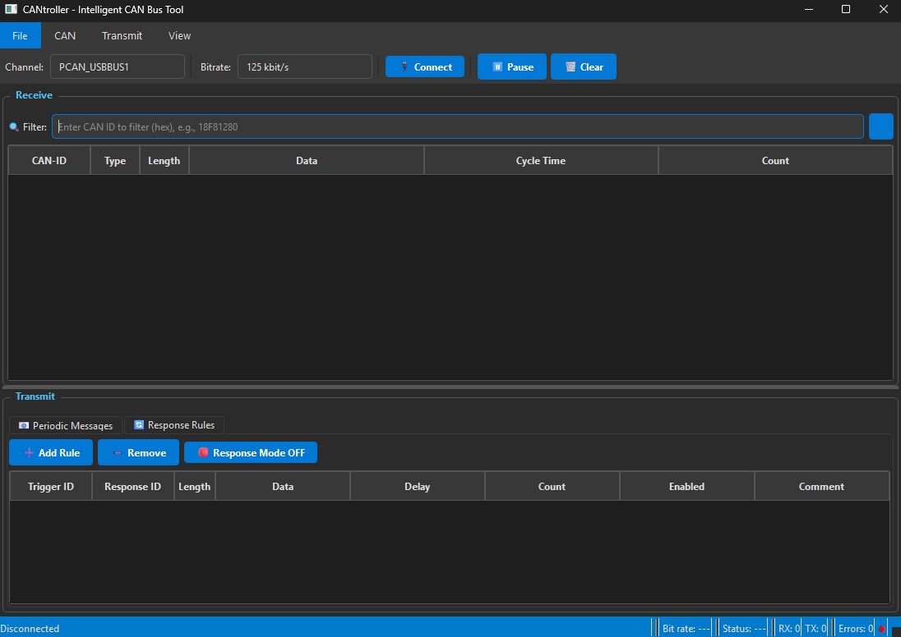

# CANtroller

<p align="center">
  
</p>

**CANtroller** is an intelligent CAN bus monitoring, control, and simulation tool for electric vehicle development. Built with Python and PyQt6, it provides a professional interface similar to PCAN-View with added intelligent features like auto-response, signal decoding, and a full EV simulation engine.

## ✨ Features

### Core
- 🔍 **Real-time CAN Monitoring** — View all CAN messages with ID, data, cycle time, and count
- 📧 **Periodic Message Transmission** — Send messages at configurable intervals
- 🔄 **Intelligent Auto-Response** — Automatically respond to specific CAN IDs with custom data
- 🔢 **Byte Increment Counter** — Auto-increment a chosen byte in periodic messages or responses for manual testing
- 📊 **Signal Decoding** — Decode CAN data into readable values (Speed:20km/h, Voltage:100V)
- 📥 **CSV Import** — Import CAN IDs and signal definitions from CSV files

### Simulation
- 🏍️ **EV Simulation Engine** — Full battery/motor simulation with realistic BMS and MCU CAN frames
- 📈 **Trip Profiles** — Pre-built city, highway, and charge profiles
- 📂 **CSV Trip Import** — Import real driving data from CSV files with auto-detection of columns
- 🔋 **Realistic Battery Model** — 72V NMC 20S pack, 73Ah capacity, regenerative braking
- ⚡ **Live Data Display** — Real-time voltage, current, SOC, speed, mileage, and gear

### Interface
- 🔢 **3-Mode Data Display** — Toggle between HEX, Decimal, and Decoded views
- 🎨 **Modern Dark Theme** — Professional and eye-friendly interface
- 💾 **Save/Load Configuration** — Persist messages and rules in `.cantroller` files
- 🔎 **Message Filtering** — Quick filter by CAN ID
- 📊 **Detailed Status Bar** — RX/TX counts, error tracking, connection status

## 🚀 Quick Start

### Prerequisites

- Python 3.10+
- PCAN-USB adapter with drivers installed

### Installation

```bash
# Clone the repository
git clone https://github.com/joaopef/CANtroller.git
cd CANtroller

# Install dependencies
pip install -r requirements.txt

# Run the application
python src/main.py
```

### Download Executable

For Windows users, download the pre-built executable from the [Releases](https://github.com/joaopef/CANtroller/releases) page.

## 📖 Usage

### Connecting to CAN Bus

1. Select your PCAN channel (PCAN_USBBUS1, etc.)
2. Choose the bitrate (125k, 250k, 500k, 1M)
3. Click **Connect**

### Periodic Messages

1. Go to **Transmit → New Message** or press `Ins`
2. Configure the CAN ID, data bytes, and cycle time
3. Optionally select a **byte to auto-increment** (0-7) for testing
4. Messages will transmit automatically when connected

### Auto-Response Rules

1. Switch to the **Response Rules** tab
2. Click **Add Rule**
3. Set the trigger ID (incoming message to react to)
4. Set the response ID and data to send back
5. Optionally enable **byte auto-increment** on the response
6. Enable **Response Mode** to activate

### Simulation Mode

1. Switch to the **Simulation** tab
2. Select a pre-built profile (City, Highway, Charge) or import a CSV trip file
3. Click **Start** — the simulator sends BMS and MCU CAN frames
4. Monitor live data: voltage, current, SOC, speed, mileage, and gear
5. Adjust playback speed with the slider

### Signal Decoding

1. Go to **File → Import → Import CAN Blocks** and select your CSV file
2. Go to **File → Import → Import Signal Definitions** and select your data points CSV
3. Click on the **Data** column header to cycle through: HEX → Decimal → Decoded
4. In Decoded mode, signals display as `Speed:20km/h Voltage:100V`

**CSV Formats:**

*CAN Blocks.csv:*
```csv
CAN bus Nr,Name,CAN ID [hex],Ext,Send period max [ms],...
CAN_BUS_0,GET_SOC_1,0x18F81280,1,0,...
```

*CAN Data Points.csv:*
```csv
CAN ID,CAN Data Point,Signal name,Bit start,Bit length,Factor,Unit
0x18F86890,SPEED,Current speed,0,8,1,km/h
```

### Saving Configuration

- **Ctrl+S** — Save current configuration
- **Ctrl+O** — Open a saved configuration
- **Ctrl+N** — New configuration (clear all)

## 🏗️ Architecture

```
┌──────────────────────────────────────────────────────────────┐
│                       CANtroller                             │
├──────────────────────────────────────────────────────────────┤
│  ┌──────────┐   ┌──────────────┐   ┌─────────────┐          │
│  │ main.py  │──▶│ main_window  │◀──│ can_manager  │          │
│  │ (Entry)  │   │    (GUI)     │   │   (Logic)    │          │
│  └──────────┘   └──────┬───────┘   └──────┬──────┘          │
│                        │                   │                 │
│                        ▼                   ▼                 │
│                 ┌──────────────┐    ┌───────────┐            │
│                 │  simulator   │    │python-can │            │
│                 │  (EV Sim)    │    └─────┬─────┘            │
│                 └──────────────┘          │                  │
│                                          ▼                  │
│                                   ┌───────────┐             │
│                                   │ PCAN-USB  │             │
│                                   └───────────┘             │
└──────────────────────────────────────────────────────────────┘
```

## 📁 Project Structure

```
CANtroller/
├── docs/                    # Documentation
│   └── architecture.md      # Architecture details
├── src/                     # Source code
│   ├── main.py              # Entry point + dark theme
│   ├── main_window.py       # GUI implementation (~2200 lines)
│   ├── can_manager.py       # CAN communication logic (~320 lines)
│   └── simulator.py         # EV simulation engine (~600 lines)
├── .gitignore
├── LICENSE                  # MIT License
├── README.md
├── requirements.txt         # Python dependencies
└── CANtroller.spec          # PyInstaller configuration
```

## 🛠️ Building Executable

```bash
# Install PyInstaller
pip install pyinstaller

# Build using the spec file
pyinstaller CANtroller.spec

# The executable will be in dist/CANtroller.exe
```

## 📋 Configuration File Format

The `.cantroller` file is a JSON file containing:

```json
{
  "version": "1.0",
  "settings": {
    "channel": "PCAN_USBBUS1",
    "bitrate": "500 kbit/s"
  },
  "periodic_messages": [
    {
      "msg_id": 418381314,
      "data": [3, 232, 0, 100, 0, 50, 0, 0],
      "is_extended": true,
      "cycle_time_ms": 100,
      "is_paused": false,
      "comment": "BMS Response",
      "increment_byte": -1
    }
  ],
  "response_rules": [
    {
      "trigger_id": 418381376,
      "response_id": 418397186,
      "response_data": [3, 232, 0, 100, 0, 50, 0, 0],
      "is_extended": true,
      "delay_ms": 10,
      "comment": "Auto Response",
      "enabled": true,
      "increment_byte": -1
    }
  ]
}
```

## 🤝 Contributing

Contributions are welcome! Please feel free to submit a Pull Request.

## 📄 License

This project is licensed under the MIT License - see the [LICENSE](LICENSE) file for details.

## 👤 Author

**João Ferreira**

- GitHub: [@joaopef](https://github.com/joaopef)

---

<p align="center">
  Made with ❤️ for the automotive community
</p>
