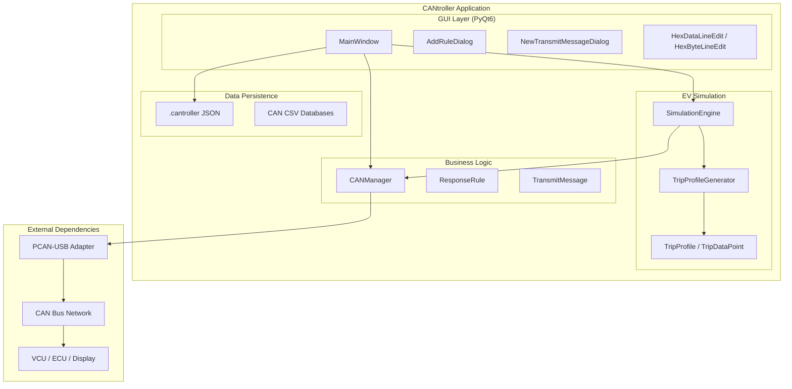
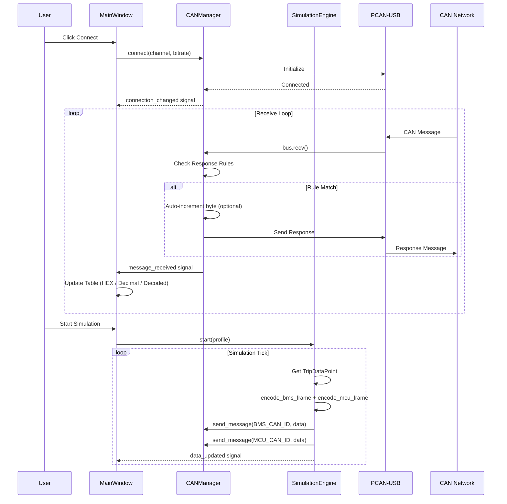
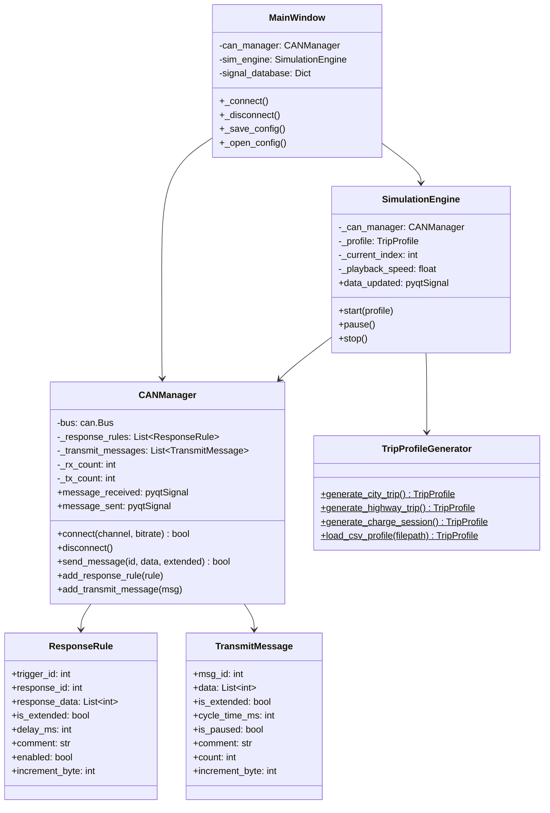

# CANtroller Architecture

## System Overview



## Component Details

### main.py
- Application entry point
- Dark theme stylesheet definition
- QApplication initialization

### main_window.py (~2200 lines)
- `MainWindow` — Main application window with receive/transmit/simulation tabs
- `AddRuleDialog` — Dialog for creating/editing response rules (with increment byte option)
- `NewTransmitMessageDialog` — Dialog for periodic messages (with increment byte option)
- `HexDataLineEdit` — Auto-formatting hex input with space separation
- `HexByteLineEdit` — Single byte input with auto-tab to next field

### can_manager.py (~320 lines)
- `CANManager` — CAN bus communication handler (connect, send, receive, auto-respond)
- `ResponseRule` — Auto-response rule dataclass (with `increment_byte` field)
- `TransmitMessage` — Periodic message dataclass (with `increment_byte` field)

### simulator.py (~600 lines)
- `SimulationEngine` — Plays trip profiles by encoding and sending BMS/MCU CAN frames
- `TripProfileGenerator` — Generates synthetic profiles (city, highway, charge) or loads CSV data
- `TripProfile` / `TripDataPoint` — Data structures for trip data
- `encode_bms_frame()` / `encode_mcu_frame()` — Big-endian CAN frame encoding

## Data Flow



## Simulation Engine

### Battery Model
| Parameter | Value |
|---|---|
| Chemistry | NMC Pouch Cells |
| Configuration | 20S |
| Nominal Voltage | 72V |
| Full Charge | 84V (4.2V/cell) |
| Cutoff | 60V (3.0V/cell) |
| Capacity | 73Ah (5256Wh) |
| Max Continuous | 110A |
| Peak (5s) | 250A |

### CAN Frame Encoding (Big-Endian)

**BMS Frame** (`0x18F81280` — GET_SOC_1):
| Bytes | Content | Encoding |
|---|---|---|
| 0-1 | Voltage | raw × 10 (e.g., 720 = 72.0V) |
| 2-3 | Current | raw × 20, signed (e.g., 600 = 30.0A) |
| 4 | SOC | 0-100% |
| 5-7 | Reserved | 0x00 |

**MCU Frame** (`0x18F86890` — GET_MCU_1):
| Bytes | Content | Encoding |
|---|---|---|
| 0 | Speed | km/h (0-255) |
| 1-3 | Total mileage | km (24-bit) |
| 4 | Current mileage | km (0-255) |
| 5 | Gear | 0=Park, 1=ECO, 2=Normal, 3=Sport |
| 6-7 | Reserved | 0x00 |

## Configuration File Format

```json
{
  "version": "1.0",
  "settings": {
    "channel": "PCAN_USBBUS1",
    "bitrate": "500 kbit/s"
  },
  "periodic_messages": [
    {
      "msg_id": 418381314,
      "data": [3, 232, 0, 100, 0, 50, 0, 0],
      "is_extended": true,
      "cycle_time_ms": 100,
      "is_paused": false,
      "comment": "BMS Response",
      "increment_byte": -1
    }
  ],
  "response_rules": [
    {
      "trigger_id": 418381376,
      "response_id": 418397186,
      "response_data": [3, 232, 0, 100, 0, 50, 0, 0],
      "is_extended": true,
      "delay_ms": 10,
      "comment": "Auto Response",
      "enabled": true,
      "increment_byte": 0
    }
  ]
}
```

> **Note:** `increment_byte` — Set to `-1` to disable, or `0-7` to auto-increment that byte position on each send (wraps 255 → 0).

## Class Diagram


