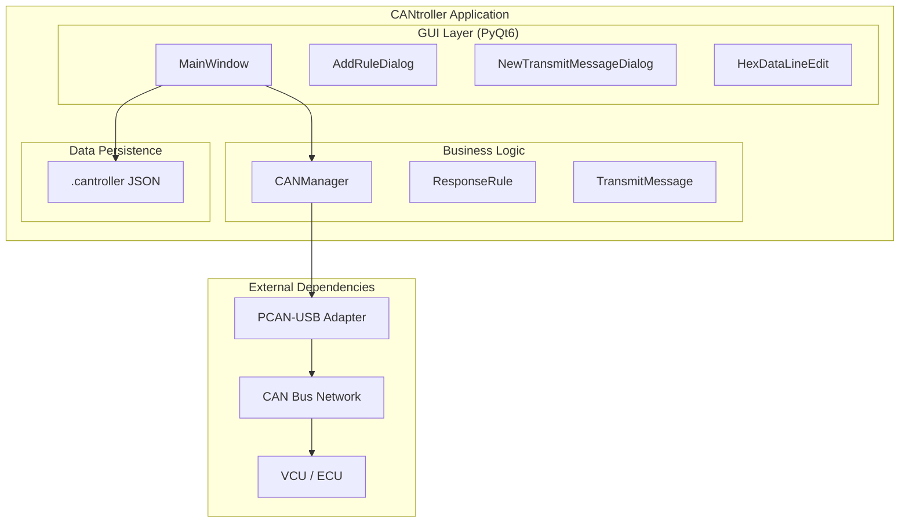
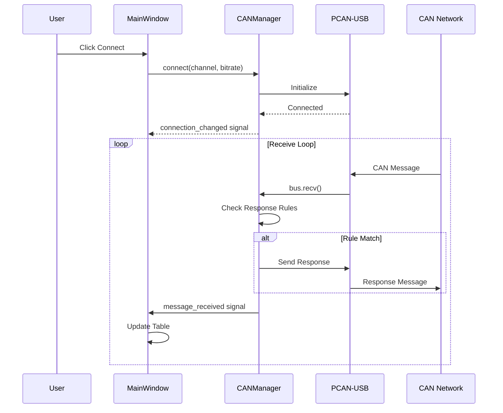
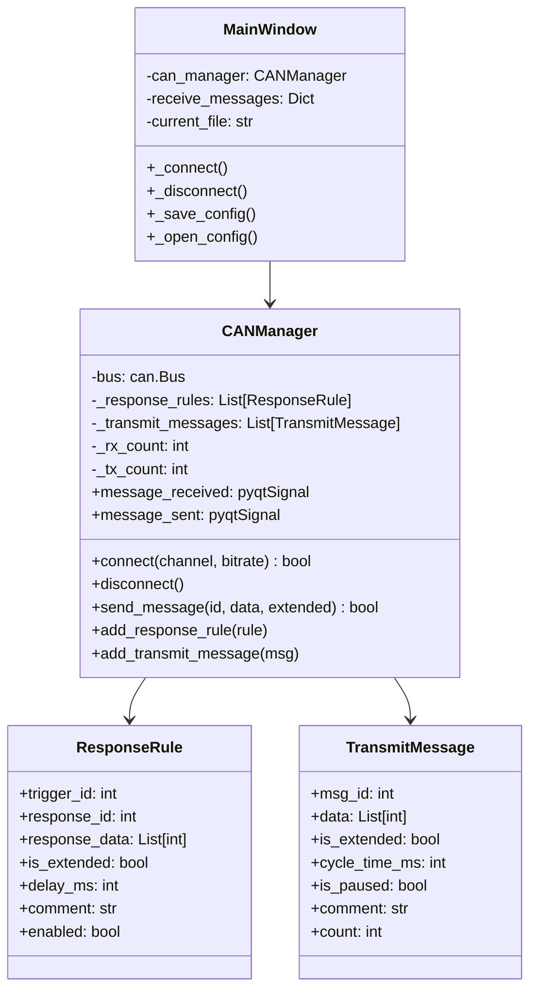

# CANtroller Architecture

## System Overview



## Component Details

### main.py
- Application entry point
- Dark theme stylesheet definition
- QApplication initialization

### main_window.py (~1300 lines)
- `MainWindow` - Main application window
- `AddRuleDialog` - Dialog for response rules
- `NewTransmitMessageDialog` - Dialog for periodic messages  
- `HexDataLineEdit` - Auto-formatting hex input
- `HexByteLineEdit` - Single byte input with auto-tab

### can_manager.py (~310 lines)
- `CANManager` - CAN bus communication handler
- `ResponseRule` - Auto-response rule dataclass
- `TransmitMessage` - Periodic message dataclass

## Data Flow



## Configuration File Format

```json
{
  "version": "1.0",
  "settings": {
    "channel": "PCAN_USBBUS1",
    "bitrate": "500 kbit/s"
  },
  "periodic_messages": [
    {
      "msg_id": 418381314,
      "data": [3, 232, 0, 100, 0, 50, 0, 0],
      "is_extended": true,
      "cycle_time_ms": 100,
      "is_paused": false,
      "comment": "Example Message"
    }
  ],
  "response_rules": [
    {
      "trigger_id": 418381376,
      "response_id": 418397186,
      "response_data": [3, 232, 0, 100, 0, 50, 0, 0],
      "is_extended": true,
      "delay_ms": 10,
      "comment": "Auto Response",
      "enabled": true
    }
  ]
}
```

## Class Diagram


